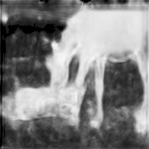
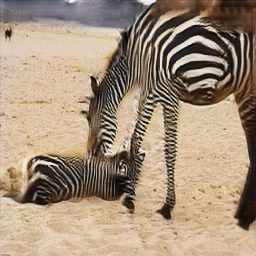
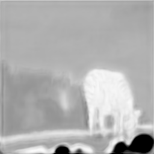
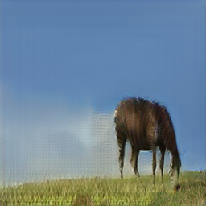
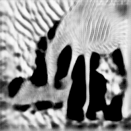
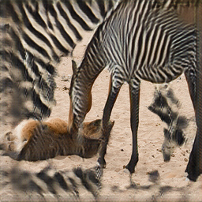
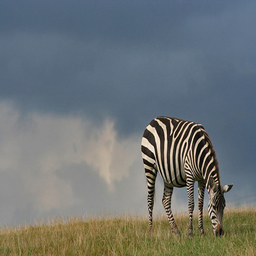
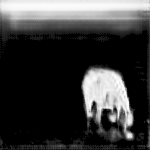
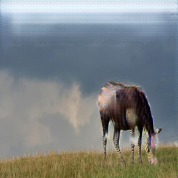

# uaggan
A Pytorch implementation of "Unsupervised Attention-Guided Image-to-Image Translation", NIPS 2018, [[Paper]](https://arxiv.org/pdf/1806.02311.pdf) | [[TF code]](https://github.com/AlamiMejjati/Unsupervised-Attention-guided-Image-to-Image-Translation)

---------

### Installation

For Conda users, we provide a installation script `./scripts/conda_deps.sh`. Alternatively, you can create a new Conda environment using this command: 
```
conda env create -f environment.yml
```

### Prepare Dataset:

 - Download a CycleGAN dataset (e.g. horse2zebra, apple2orange):

```
bash ./datasets/download_cyclegan_dataset.sh horse2zebra
```
 - Use your own dataset: put images from each domain at folder_a and folder_b respectively.

### Usage

 - Training

```
sh ./scripts/train_uaggan.sh <gpu_id>
```

or

```
nohup sh -u ./scripts/train_uaggan.sh <gpu_id> > uag.log &
```

- Test

```
sh ./scripts/test_uaggan.sh <gpu_id>
```

### Mapping results

 - horse2zebra (without early stopping, threshold=0.1)

|Real A|Attention Mask|Fake B|Real B|Attention Mask|Fake A|
|:----:|:----:|:----:|:----:|:----:|:----:|
|||||||

[[More Results >>>]](./figures/Visualization-uag.md)

 - horse2zebra (with early stopping, threshold=0.1)

//TODO

 - apple2orange

//TODO

### Faster version

Combining the attention module and domain translation module into one generator, inspired by [GANimation](https://arxiv.org/pdf/1807.09251.pdf). (**Results are not good**.)

 - Training

```
sh ./scripts/train_faster_uaggan.sh <gpu_id>
```

 - Testing

```
sh ./scripts/test_faster_uaggan.sh <gpu_id>
```

|Real A|Attention Mask|Fake B|Real B|Attention Mask|Fake A|
|:----:|:----:|:----:|:----:|:----:|:----:|
|||||||

----

### Acknowledgment

This code is based on the [pytorch-CycleGAN-and-pix2pix](https://github.com/junyanz/pytorch-CycleGAN-and-pix2pix). Thanks to the contributors of this project.
